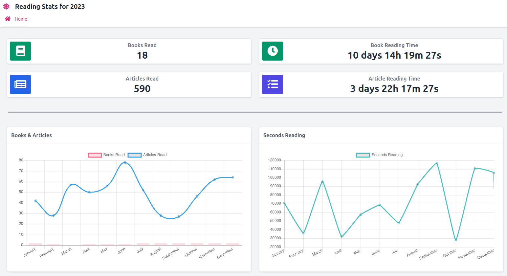

# kobo-readstat


[](/LICENSE)
[](https://github.com/timchurchard/readstat/releases/latest)
[](https://somsubhra.github.io/github-release-stats/?username=timchurchard&repository=readstat)

Attempt to collect and show reading statistics from [Kobo](https://uk.kobobooks.com/collections/ereaders) e-reader devices.  This is a proof of concept using my two devices (Kobo Clara 2E and Libra 2 with database version 174).

## Usage

Use the `sync` command to read the Kobo database and write a local json file. And use the `stats` command to read the local json file to make statistics.

```shell
./kobo-readstat sync -d ./testfiles/20231219/libra2/KoboReader.sqlite -s tc_readstat.json
```

And the `stats` command to show stats in text or html

```text
./kobo-readstat stats -y 2023 -s ./tc_readstat.json --mode html --out tc_2023.html
```


```text
Year: 2023
Finished books			: 18
Finished articles		: 590
Time reading books		: 10 days 14 hours 19 minutes 27 seconds (hours: 254.32)
Time reading articles		: 3 days 22 hours 17 minutes 27 seconds (hours: 94.29)
Total time reading		: 14 days 12 hours 36 minutes 54 seconds (hours: 348.61)

----------

January 2023 - Finished books: 2, articles: 42, time spend reading books: 1 days 4 hours 33 minutes 43 seconds (hours: 28.56) and articles: 9 hours 21 minutes 16 seconds (hours: 9.35)
	 finished book: Northern Lights - Philip Pullman (Duration: 7h42m12s over 41 Sessions)
	 finished book: The Subtle Knife - Philip Pullman (Duration: 9h54m9s over 45 Sessions)

February 2023 - Finished books: 1, articles: 28, time spend reading books: 14 hours 43 minutes 14 seconds (hours: 14.72) and articles: 2 hours 23 minutes 28 seconds (hours: 2.39)
	 finished book: The Amber Spyglass - Philip Pullman (Duration: 16h44m15s over 113 Sessions)

March 2023 - Finished books: 0, articles: 57, time spend reading books: 4 hours 0 minutes 53 seconds (hours: 4.01) and articles: 9 hours 42 minutes 2 seconds (hours: 9.70)

April 2023 - Finished books: 1, articles: 50, time spend reading books: 15 hours 55 minutes 17 seconds (hours: 15.92) and articles: 8 hours 27 minutes 6 seconds (hours: 8.45)
	 finished book: Matilda - Roald Dahl & Quentin Blake (Duration: 28m40s over 6 Sessions)

May 2023 - Finished books: 1, articles: 56, time spend reading books: 11 hours 9 minutes 55 seconds (hours: 11.17) and articles: 8 hours 33 minutes 45 seconds (hours: 8.56)
	 finished book: Star's Reach: A Novel of the Deindustrial Future - John Michael Greer (Duration: 7h21m48s over 52 Sessions)

June 2023 - Finished books: 1, articles: 78, time spend reading books: 5 hours 55 minutes 3 seconds (hours: 5.92) and articles: 13 hours 44 minutes 17 seconds (hours: 13.74)
	 finished book: Everything's Eventual: 14 Dark Tales - Stephen King (Duration: 5h14m6s over 39 Sessions)

July 2023 - Finished books: 2, articles: 52, time spend reading books: 1 days 11 hours 0 minutes 45 seconds (hours: 35.01) and articles: 8 hours 7 minutes 18 seconds (hours: 8.12)
	 finished book: The Gallows Pole - Benjamin Myers (Duration: 5h11m38s over 35 Sessions)
	 finished book: The Three-Body Problem, No. 2: Dark Forest - Liu Cixin (Duration: 22h3m16s over 128 Sessions)

August 2023 - Finished books: 2, articles: 28, time spend reading books: 22 hours 47 minutes 51 seconds (hours: 22.80) and articles: 3 hours 34 minutes 59 seconds (hours: 3.58)
	 finished book: Molesworth - Geoffrey Willans (Duration: 5m39s over 1 Sessions)
	 finished book: Death's End - Cixin Liu (Duration: 26h35m39s over 134 Sessions)

September 2023 - Finished books: 2, articles: 27, time spend reading books: 1 days 21 hours 2 minutes 25 seconds (hours: 45.04) and articles: 5 hours 55 minutes 56 seconds (hours: 5.93)
	 finished book: Altered Carbon - Richard K. K. Morgan (Duration: 21h7m24s over 124 Sessions)
	 finished book: The Outsider: A Novel - Stephen King (Duration: 21h39m37s over 102 Sessions)

October 2023 - Finished books: 2, articles: 46, time spend reading books: 17 hours 0 minutes 28 seconds (hours: 17.01) and articles: 7 hours 34 minutes 48 seconds (hours: 7.58)
	 finished book: Lullaby - Chuck Palahniuk (Duration: 7h11m50s over 51 Sessions)
	 finished book: Eating Animals - Jonathan Safran Foer (Duration: 9h27m49s over 62 Sessions)

November 2023 - Finished books: 2, articles: 62, time spend reading books: 1 days 2 hours 49 minutes 36 seconds (hours: 26.83) and articles: 9 hours 5 minutes 12 seconds (hours: 9.09)
	 finished book: Mr Mercedes - Stephen King (Duration: 17h44m15s over 100 Sessions)
	 finished book: The Future - Naomi Alderman (Duration: 12h28m9s over 68 Sessions)

December 2023 - Finished books: 2, articles: 64, time spend reading books: 1 days 3 hours 20 minutes 17 seconds (hours: 27.34) and articles: 7 hours 47 minutes 20 seconds (hours: 7.79)
	 finished book: The Green Mile - Stephen King (Duration: 14h10m23s over 83 Sessions)
	 finished book: The Neverending Story - Michael Ende (Duration: 7h34m23s over 49 Sessions)
```